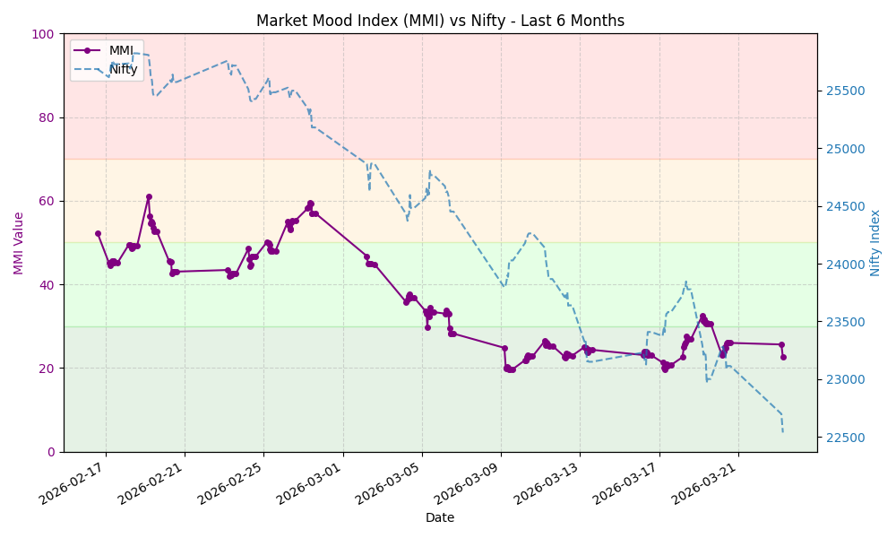

# Ticker Tape MMI Git Scraper

A daily/hourly scraper for the Ticker Tape Market Mood Index (MMI).
This repository automatically fetches the MMI value, stores the history, and generates a chart.

## Latest MMI Value

**43.04** - **Fear**
<small>Last Updated: 2026-02-20 10:24 UTC</small>

## MMI Trend (Last 30 Days)

## Data

The historical data is available in [data/history.json](data/history.json).

### Zones Reference
- **Extreme Fear:** < 30
- **Fear:** 30 - 50
- **Greed:** 50 - 70
- **Extreme Greed:** > 70

## API Access

You can access the historical data via GitHub Pages:
[https://chirag127.github.io/tickertape-mmi/data/history.json](https://chirag127.github.io/tickertape-mmi/data/history.json)

Raw JSON File:
[https://raw.githubusercontent.com/chirag127/tickertape-mmi/main/data/history.json](https://raw.githubusercontent.com/chirag127/tickertape-mmi/main/data/history.json)
