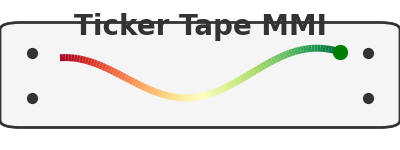

# Oriz MMI — Tickertape Market Mood Index Mirror

[](https://github.com/chirag127/tickertape-mmi/stargazers)
[](./LICENSE)

**Live:** <https://market-mood-index.api.oriz.in>



Hourly mirror of [Tickertape's Market Mood Index](https://www.tickertape.in/market-mood-index) — a 0-100 sentiment gauge for the Indian equity market. Scraped by GitHub Actions, served as static JSON via GitHub Pages and `raw.githubusercontent.com`. Zero Cloudflare Workers, zero ongoing cost.

## Endpoints (static JSON)

| URL | Description |
| --- | --- |
| `https://market-mood-index.api.oriz.in/latest.json` | Most recent scrape |
| `https://market-mood-index.api.oriz.in/<YYYY-MM-DD>.json` | A specific day (overwritten on each hourly run) |
| `https://raw.githubusercontent.com/chirag127/tickertape-mmi/main/data/latest.json` | Same data via raw (no Pages dependency) |

## Response shape (`latest.json`)

```json
{
  "date": "2026-06-22",
  "score": 55.85,
  "zone": "neutral",
  "source": "tickertape"
}
```

`source` is one of `tickertape` (primary) or `placeholder` (fetch failed). `zone` is derived from `score`:

| Zone | Range |
| --- | --- |
| `extreme-fear` | `< 30` |
| `fear` | `30 - 50` |
| `neutral` | `50 - 70` |
| `greed` | `70 - 90` |
| `extreme-greed` | `>= 90` |

## Schedule

Hourly (`0 * * * *`) — MMI updates intraday. Manually re-runnable via the **scrape** workflow.

## Local run

```bash
pnpm install
node scripts/scrape.mjs   # writes data/<today>.json + data/latest.json
```

## License

MIT — see [LICENSE](./LICENSE).
