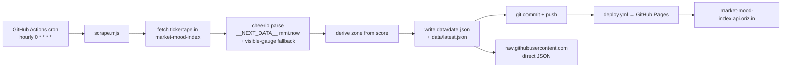

# Oriz MMI — Tickertape Market Mood Index mirror

> Hourly mirror of India's 0–100 Market Mood Index, served as static JSON. Zero infra, zero cost.

[](./LICENSE)
[](https://github.com/chirag127/tickertape-mmi/stargazers)
[](https://github.com/chirag127/tickertape-mmi/commits/main)
[](https://github.com/chirag127/tickertape-mmi/actions/workflows/deploy.yml)
[](https://nodejs.org/)


## What it is / why it exists

Tickertape's [Market Mood Index](https://www.tickertape.in/market-mood-index) is a 0–100 fear/greed sentiment gauge for the Indian equity market — but there's no clean, programmatic feed for it. This repo scrapes it hourly with GitHub Actions and serves the result as static JSON via GitHub Pages and `raw.githubusercontent.com`. No Cloudflare Workers, no server, no ongoing cost — the repo's `data/` directory is the API.

## Links

- **Live API / landing:** [market-mood-index.api.oriz.in](https://market-mood-index.api.oriz.in)
- **GitHub Pages mirror:** [chirag127.github.io/tickertape-mmi](https://chirag127.github.io/tickertape-mmi/)
- **Repo:** [github.com/chirag127/tickertape-mmi](https://github.com/chirag127/tickertape-mmi)

⭐ If this is useful, please **star the repo** — it helps others find it.

## How it works


```mermaid
flowchart LR
  A[GitHub Actions cron<br/>hourly 0 * * * *] --> B[scrape.mjs]
  B --> C[fetch tickertape.in<br/>market-mood-index]
  C --> D[cheerio parse<br/>__NEXT_DATA__ mmi.now<br/>+ visible-gauge fallback]
  D --> E[derive zone from score]
  E --> F[write data/date.json<br/>+ data/latest.json]
  F --> G[git commit + push]
  G --> H[deploy.yml → GitHub Pages]
  F --> I[raw.githubusercontent.com<br/>direct JSON]
  H --> J[market-mood-index.api.oriz.in]
```

## Features

- Hourly scrape of Tickertape MMI via GitHub Actions (`0 * * * *`) — MMI moves intraday.
- **Two-strategy parse:** reads `mmi.now` from `__NEXT_DATA__`, falls back to the visible gauge text.
- **git-as-DB** — every scrape commits `data/<YYYY-MM-DD>.json` + `data/latest.json`; free, versioned history.
- Served two ways: GitHub Pages (custom domain) **and** `raw.githubusercontent.com` (no Pages dependency).
- Graceful degradation: `source: "placeholder"` with score 50 if the fetch fails — the feed never breaks.
- Static landing page (`index.html`) with a live data preview.

## Endpoints (static JSON)

| URL | Description |
| --- | --- |
| `https://market-mood-index.api.oriz.in/data/latest.json` | Most recent scrape |
| `https://market-mood-index.api.oriz.in/data/<YYYY-MM-DD>.json` | A specific day |
| `https://raw.githubusercontent.com/chirag127/tickertape-mmi/main/data/latest.json` | Same data via raw (no Pages dependency) |

### Response shape (`data/latest.json`)

```json
{
  "date": "2026-06-22",
  "score": 55.85,
  "zone": "neutral",
  "source": "tickertape"
}
```

`source` is `tickertape` (primary) or `placeholder` (fetch failed). `zone` is derived from `score`:

| Zone | Range |
| --- | --- |
| `extreme-fear` | `< 30` |
| `fear` | `30 – 50` |
| `neutral` | `50 – 70` |
| `greed` | `70 – 90` |
| `extreme-greed` | `>= 90` |

## Tech stack

- **Runtime:** Node.js (ESM), `pnpm@10`
- **Scrape:** `cheerio` + native `fetch`
- **Automation:** GitHub Actions (hourly cron + deploy + CI + MegaLinter)
- **Hosting:** GitHub Pages + `raw.githubusercontent.com` — $0

## Repo structure

```
scripts/scrape.mjs      # the scraper: fetch → parse → write data/*.json
data/                   # latest.json + <date>.json  (git-as-DB, the API payload)
index.html              # static landing page with live data preview
src/styles/             # landing-page styles
CNAME                   # market-mood-index.api.oriz.in
.github/workflows/      # scrape (cron) · deploy (Pages) · ci · megalinter
```

## Quick start

```bash
pnpm install
node scripts/scrape.mjs   # writes data/<today>.json + data/latest.json
# or:
pnpm run scrape
```

## Configuration

No configuration required. The scraper takes no secrets and no env vars — it fetches a public page and writes JSON.

## Part of the oriz family

One of ~80 [oriz](https://blog.oriz.in) sites. Read how the fleet is built solo at [blog.oriz.in](https://blog.oriz.in).

**Cost:** $0 — GitHub Pages + GitHub Actions free minutes.

## Security

No secrets in the repo; sops+age vault for the fleet. This mirror needs none. See [SECURITY.md](./SECURITY.md).

## Contributing

Issues and PRs welcome — see [CONTRIBUTING.md](./CONTRIBUTING.md). Terse, conventional commits. Verify Tickertape's page structure before touching the parser.

## Status

Stable. Runs hourly in production.

## Changelog

Conventional commits are the changelog.

## Disclaimer

General information, not investment advice. MMI is a sentiment gauge, not a trade signal.

## License

MIT © 2026 Chirag Singhal — see [LICENSE](./LICENSE).

## Author

Chirag Singhal · chirag@oriz.in
